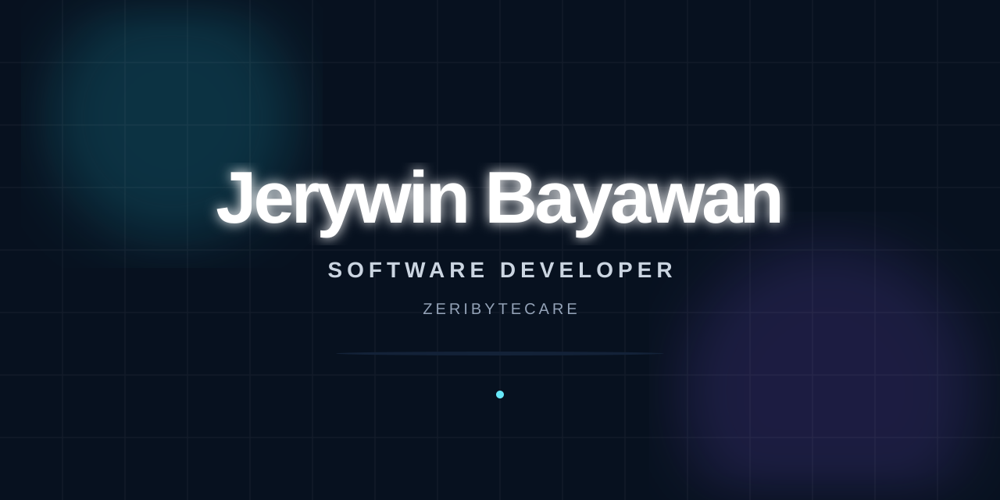

<p align="center">
  
</p>
# Hi, I'm Jerywin Bayawan

### Software Developer · Full-Stack Engineer · Zeribytecare

I design and build secure, scalable, and production-ready software.

<br />

[](https://quickee.online)
[](https://github.com/zeribytecare)
[](mailto:your@email.com)

</div>

---

## Developer Profile

```ts
const developer = {
  name: "Jerywin Bayawan",
  role: "Software Developer",
  brand: "Zeribytecare",
  location: "Davao City, Philippines",

  specialties: [
    "Full-Stack Development",
    "Backend Engineering",
    "API Development",
    "Mobile Applications",
    "Database Design",
    "Cloud Deployment",
  ],

  principles: [
    "Secure by default",
    "Scalable architecture",
    "Clean and maintainable code",
    "Reliable production delivery",
  ],

  mindset: "Build. Secure. Scale.",
};
```

---

## Tech Stack

<div align="center">

### Frontend


### Backend


### Database


### Tools and Infrastructure


</div>

---

## What I Focus On

<div align="center">

| Area | Focus |
|---|---|
| Frontend | Responsive and accessible interfaces |
| Backend | Secure APIs and business logic |
| Database | Reliable schemas and data integrity |
| Security | Authentication, authorization, and validation |
| Mobile | Cross-platform and offline-first applications |
| Deployment | Docker, Linux, HTTPS, and production infrastructure |

</div>

---

## GitHub Statistics

<div align="center">


</div>

<div align="center">


</div>

---

## Contribution Activity

<div align="center">


</div>

---

## Connect With Me

<div align="center">

[](https://quickee.online)
[](https://github.com/zeribytecare)
[](mailto:your@email.com)

</div>

---

<div align="center">

### Build secure systems. Solve real problems. Deliver reliable software.

</div>
