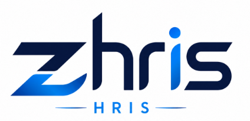
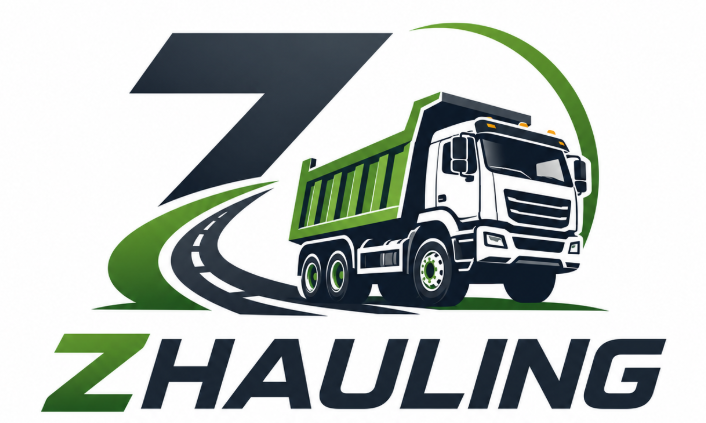
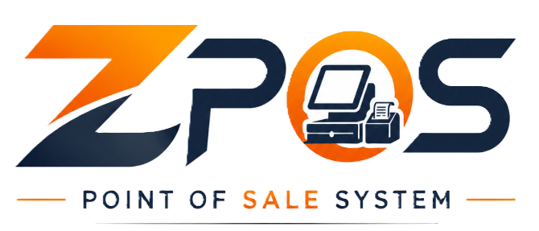
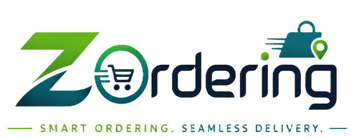

# Hi, I'm Jerywin Bayawan 👋

### Software Developer • Full-Stack Engineer • Zeribytecare

I build secure, scalable, and production-ready web applications with modern technologies.

---

# 🚀 Featured Projects

<table>
<tr>
<td width="50%" valign="top">

### 

 **ZPay** A secure, multi-tenant payment collection and billing management system supporting recurring, installment, partial, and one-time payments.

**Tech Stack**

`React` `TypeScript` `Node.js` `Express` `PostgreSQL`

[View Project](https://github.com/zeribytecare)

</td>

<td width="50%" valign="top">

###  

**HR Management** System A complete HR information system with employee management, attendance, payroll, leave requests, approvals, and reporting.

**Tech Stack**

`React` `Node.js` `Express` `PostgreSQL` `Redis`

[View Project](https://github.com/zeribytecare)

</td>
</tr>

<tr>
<td width="50%" valign="top">

###  

 **Hauling ERP** A fleet and hauling management platform for trip tickets, equipment operations, billing, payroll, maintenance, and fuel monitoring.

**Tech Stack**

`React` `TypeScript` `Node.js` `PostgreSQL` `Docker`

[View Project](https://github.com/zeribytecare)

</td>

<td width="50%" valign="top">

###  

**ZPOS** A restaurant point-of-sale system with dine-in, takeout, delivery, kitchen display, inventory, payments, and sales analytics.

**Tech Stack**

`React` `Node.js` `Express` `PostgreSQL` `Socket.io`

[View Project](https://github.com/zeribytecare)

</td>
</tr>

<tr>
<td width="50%" valign="top">

###  

**ZOrdering** A multi-branch ordering platform with online menus, order management, inventory tracking, reporting, and real-time status updates.

**Tech Stack**

`React` `TypeScript` `Node.js` `Sequelize` `PostgreSQL`

[View Project](https://github.com/zeribytecare)

</td>

<td width="50%" valign="top">

### More Projects

Explore my other software projects, experiments, and open-source repositories.

 

[View All Repositories](https://github.com/zeribytecare?tab=repositories)

</td>
</tr>
</table>

---

# 🛠 Tech Stack

### Frontend

### Backend

### Database

### DevOps & Cloud

### Tools

---

# 🚀 Featured Projects

| Project | Description | Tech |
|---------|-------------|------|
| **💳 ZPay** | Multi-tenant payment collection and billing management platform supporting recurring, installment, partial, and one-time billing. | React • Node.js • PostgreSQL |
| **👥 HR Management System** | Complete HRIS with payroll, attendance, leave management, employee portal, and reports. | React • Express • PostgreSQL |
| **🚛 Hauling ERP** | Fleet operations, payroll, billing, maintenance, trip tickets, and equipment management system. | React • Node.js |
| **🍽 ZPOS** | Restaurant POS with ordering, kitchen display, inventory, and analytics dashboard. | React • PostgreSQL |

➡️ **View more projects:** https://github.com/zeribytecare?tab=repositories

# 📌 Current Focus

- 🚀 Building production-ready SaaS applications
- 🔒 Secure authentication and authorization
- 📱 Cross-platform mobile applications
- ⚡ Performance optimization
- ☁️ Cloud-native deployments
- 🏗 Scalable software architecture

---

# 📫 Connect With Me

---

### Learn. Build. Share. Repeat.

⭐ If you like my work, consider following my GitHub profile.

